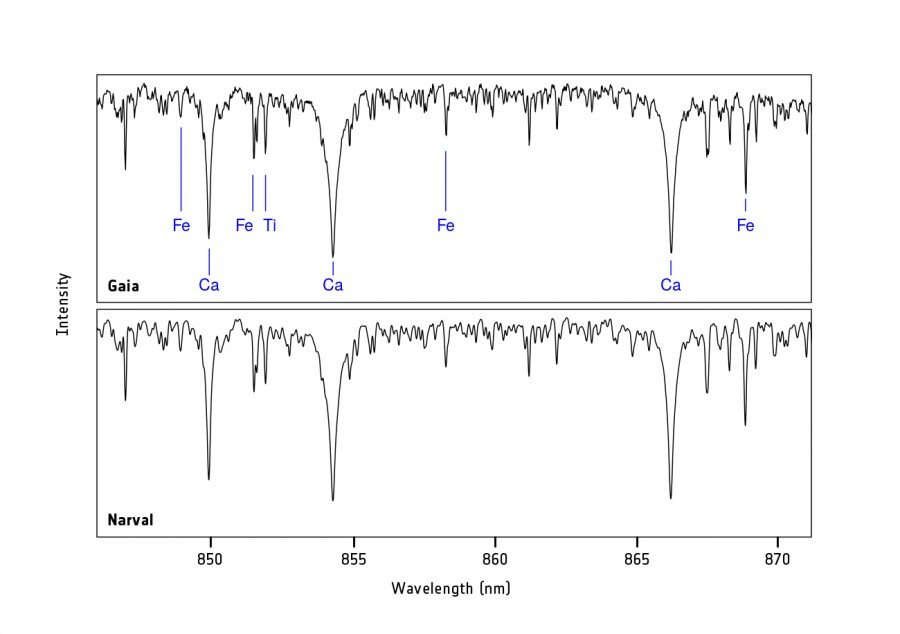
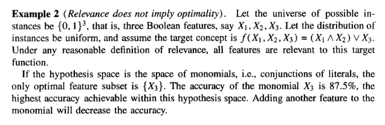
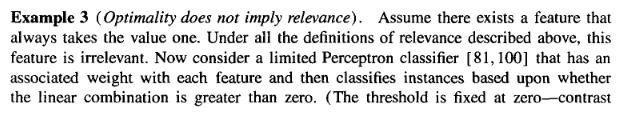
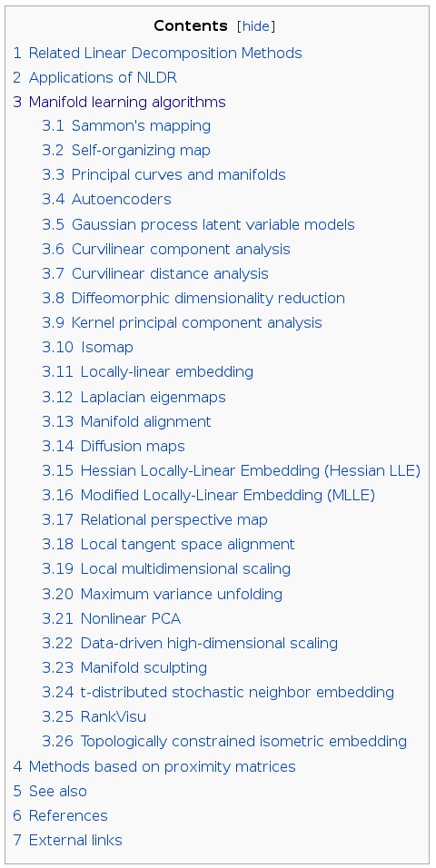

```{r setup, include=FALSE}
knitr::opts_chunk$set(cache=TRUE)
knitr::opts_chunk$set(unnamed.chunk.label = "A")
```

##########################################################################

## Introduction

One oversimplistic definition of supervised classification/regression is the construction (=training) of statistical models from sets of examples (training sets) that can formulate predictions for previously unseen data (the prediction set).

The construction of the training sets is not  covered in depth in this course, but it is one of the most critical stages of statistical learning. The training set will often be a sample of the population or universe to which our models will be applied. Amongst other requirements, we should aim at collecting training sets that

1. represent as faithfully as possible the population probability density, 
2. represent the population noise properties
3. live in optimal representation spaces

The representation space is the space of features (predictors, regressors, explanatory variables...) used to represent each training example (obvious!). These could be spectra, spectral energy distributions (SEDs), calorimeter images, energy loss, particle momentum...

An optimal (in the sense of supervised learning) representation space is one that includes all features that convey the information needed for the inference at stake, and minimizes redundancy.

This informal definition leads us to the concepts of information, relevance, and redundancy. We will visit each of them during this session. 

Now, why should we want to use an optimal representation space? There are six main reasons for this:

1. if the information needed to do the inference is not present amongst the predictive variable, there is no hope that we can train a model that performs better than random. Obvious! So we need relevant features.
2. if we use irrelevant variables, there is a non-negligible chance that spurious correlations appear between these and the target variable. This will lead to poor performance.
3. the less variables we need to build our models, the easier it will be to collect training sets (measurement is costly in general).
4. the less variables we need to build our models, the simpler and more interpretable they will be
5. the less variables we need to build our models, the shorter the training times
6. **to avoid the curse of dimensionality**

Today, we will start by looking precisely at the *curse of dimensionality*. Then. I will introduce a data set that I will (and you can) use to play with and illustrate some of the techniques for dimensionality reduction. Then, I will present a more mathematical definition of relevance using a somewhat artificial example.

The next block is named *The filter approach* and I will use it to introduce a few very important concepts, mainly from the field of Information Theory. This block will be about ranking predictors according to some Figures-of-Merit, the objective being to only retain predictors high in the ranks. 

After that, we will learn that rankings are not enough as they provide an insufficient picture that does not incorporate interactions between predictors. So, we will have to review a few simple strategies to search in the very wide landscape of feature subsets. As a coda, I will introduce you to the other two strategies to feature selection: the wrapper approach and embedded feature selection.

Finally, I will show you that feature selection techniques (the focus of the two previous blocks) should be distinguished from feature extraction. While feature extraction creates new features by transforming and combining  the original features, feature selection only returns a subset of these original features. And then, we will look at a handful of feature extraction techniques which I find specially appealing.


#######################################################################

## The curse of dimensionality: an example

```{r echo=FALSE}
require(plotrix)
n <- 1061
```

Imagine that we are dealing with Gaia RVS spectra. These spectra are characterized by a wavelength coverage of 845–872 nm with R=11500. 



As you can see, the range is small but contains a number of spectral lines that are important diagnostics of the thermodynamic state of the stellar atmosphere. Therefore, one can think of the very useful task to predict this thermodynamic state (temperature, density, pressure, chemical composition) from observed spectra. This is a statistical regression problem, as we were taught in previous sessions. 

Let us now concentrate in the problem of handling feature spaces of the size of an RVS spectrum. It typically contains circa `r n` fluxes, many of which contain no information about the stellar physical parameters. This represents a `r n`-dimensional space. 

Now, imagine a set of example RVS spectra from stars of many different temperatures (surface gravities, metallicities...). Our aim is to construct a model that predicts temperatures from an observed spectrum. Let us do it using one of the most simple models at hand: the $k$-nearest neighbours (kNN). kNN will receive an observed spectrum and look for the $k$ closest spectra in the set of examples. What do you think would be a reasonable value for $k$? Let us start with k=1: we will attach to the observed spectrum the temperature of the example that is **closest** in some to-be-determined sense.

Now, for the sake of clarity, let us rescale each observed flux between 0 and 1. This is not necessary, but helps visualize the problem. We, of course, use the same rescaling for the observed spectrum and for the training set. After rescaling, our data set occupies a unit hypercube in `r n` dimensions. 

Now, let us ask ourselves how many examples we need to ensure that the **closest** example (in the to-be-determined sense) is not further than a 10% of the total range [0,1] in each flux. This is already very far! So one would naïvely expect that this loose requirement leads to a need for few training examples. 

If our spectra had only 2 measured fluxes, this furthest example would be at a distance equal to $\sqrt{0.1^2+0.1^2}$=`r sqrt(0.1^2+0.1^2)`.

```{r, out.width='100px', out.height='750px'}
plot(cbind(0,0),xlim=c(0,1),ylim=c(0,1),xlab="feature #1",ylab="feature #2",col="white")
points(cbind(0.6,0.3),pch=16,col="blue")
r <- sqrt(0.1^2+0.1^2)
draw.circle(0.6,0.3,r)
```

How many examples do we need to ensure that there is always an example within a radius of `r sqrt(0.1^2+0.1^2)`? Well, the total area of the square is 1, and that of the circle is $\pi*r^2$=`r pi*r^2` so we need $\frac{1}{\pi*r^2}$=`r 1/(pi*r^2)`.

That is roughly 16 examples distributed homogeneously in the 2D square.

Let us now look at the true RVS space. The hypercube volume still is 1, but the volume of the hypersphere in $n$ dimensions is now $\frac{2\cdot r^d*\pi^{n/2}}{\Gamma(n/2)}$. Our RVS spectra have `r n` fluxes,  so if we still enforce that the farthest example is at most at a 10% in each dimension, the examples have to be **closer** than $$d=\sqrt{\sum_{i=1}^{n} 0.1^2}.$$ That is, there has to be an example at a distance d<`r sqrt(n*0.1^2)`.

How many examples do we need to ensure that there is at least one within a circle of radius `r sqrt(n*0.1^2)`? 

A hypersphere in `r n` dimensions of radius `r sqrt(n*0.1^2)` has a log-volume equal to 

```{r} 
r <- sqrt(n*0.1^2)
logVsphere <- log(2)+n*log(r)+(n/2)*log(pi)-lgamma(n/2)
print(logVsphere)
```

So (in the hypothesis of training examples distributed homogeneously in the hypercube), we would need 

$$\frac{1}{\exp(logVsphere)}$$ examples or, in natural logarithmic units (otherwise I get an infinity in R)

we would need 10^`r as.integer(log(1)-logVsphere)` examples. This is just unfeasible.

So if we go kNN, it is unthinkable that we can gather a large enough set of training examples such that the closest example is at a distance shorter than that implied by a 10% difference in each feature. A 10%! That is a lot.

There are other ways to visualize this curse-of-dimensionality. But in practice they all imply an exponentially increasing training set size with increasing space dimensionality. Or conversely, it implies that for a fixed training set size, the predictive power degrades with the dimensionality of the space (the so-called Hughes phenomenon). 

OK. I have been cheating a little bit here. This hypercube thing does not apply to the RVS spectra described before, but the reasons will become clear towards the end of today.. 

#######################################################################

## The RVS data set

In the following, we will apply a series of feature selection or feature extraction techniques to a dataset taken from the Gaia simulations. This dataset consists of 1000 spectra synthesized from the [MARCS](http://marcs.astro.uu.se/) library of stellar atmospheric models. 

This is not the full dataset used to train the Machine Learning algorithms that will run as part of the Gaia Data Processing and Analysis. Only a tiny subset selected to be at the same time illuminating for you, and manageable within the school lecture durations.

It was selected by forcing the stellar metallicities and alpha abundances to be solar, and then extracting only a set representative of a single apparent brightness (G=12). Furthermore, the radial velocities and rotational velocities are negligible.

Finally, all spectra have been normalized to unit area. That is, the area under each spectrum is 1 (in the somewhat awkward units of pixel position). We have done this because the actual value of the observed fluxes carry no information on any of the physical parameters (this is not exactly so, but let's assume it for the sake of simplicity). We could have exactly the same star at two wildly different distances and therefore, very different observed fluxes. 

OK. Let us load the spectra and have a first grasp of how they look like.

```{r }

StPa <- read.table("stellarParameters.dat",colClasses="numeric",sep=",")
names(StPa) <- c("teff","logg","met")
Spec <- read.table("spectra.dat",sep=",")

library(scales)
library(fields)

pal <- colorRampPalette(c("yellow","red"),space="rgb")
SetupPalette<-function(c)
{
  nl <- 50
  palette<-pal(nl)
  #palette <- tim.colors(nl)
  #palette <- heat.colors(nl)
  col <- c-min(c,na.rm=TRUE)
  col <- col/max(col,na.rm=TRUE)
  colour <- palette[as.integer(((nl-1)*col)+1)]
  return(colour)
}

n <- dim(Spec)[1]
col <- SetupPalette(StPa[,1])

wv <- as.integer(10*read.table("wavelengths.dat")[1,90:1150])

par(mar=c(6,6,6,6))
plot(as.numeric(Spec[1,]),ty="l",col=alpha(col[1],0.2),ylim=c(0.0005,0.001), xlab="Pixel Number",ylab="Normalized Flux")

axis(3,seq(0,1000,by=200),labels=wv[1+seq(0,1000,by=200)])

for (i in 2:n)
{
  lines(as.numeric(Spec[i,]),col=alpha(col[i],0.2))
}

image.plot(legend.only=TRUE, zlim= range(StPa[,1],na.rm=T), horizontal=FALSE,
           legend.width=2, reset.graphics=TRUE, axis.args=list(cex.axis=1,cex.lab=1),
           legend.mar=5,col=pal(50))
  

```

So we basically see two things: 

* There are lines that are only present in certain wavelength ranges. If you want a reasonable introduction to the behaviour of lines in stellar spectra, I certainly recommend you the books by D. Gray. For an identification of the lines present in the RVS range, you can have a look at the recent  (article by Recio-Blanco et al)[http://www.aanda.org/articles/aa/pdf/2016/01/aa25030-14.pdf]. 
* Even for the same temperature, there are very significant variations across spectra


Let us look at the other free variable: surface gravity.

``` {r}

mask <- StPa[,1] == 3.9

col <- SetupPalette(StPa[,2])

par(mar=c(6,6,6,6))
plot(as.numeric(Spec[mask,][1,]),ty="l",col=alpha(col[mask][1],0.2),ylim=c(0.0005,0.001), xlab="Pixel Number",ylab="Normalized Flux")

axis(3,seq(0,1000,by=200),labels=wv[1+seq(0,1000,by=200)])

for (i in 2:sum(mask))
{
  lines(as.numeric(Spec[mask,][i,]),col=alpha(col[mask][i],0.2))
}

image.plot(legend.only=TRUE, zlim= range(StPa[mask,2],na.rm=T), horizontal=FALSE,
           legend.width=2, reset.graphics=TRUE, axis.args=list(cex.axis=1,cex.lab=1),
           legend.mar=5,col=pal(50))

save.image()

```

#######################################################################

## Relevance

Once we have seen that high-dimensional spaces can be a curse, we need criteria to reduce the dimensionality of the input space without losing important information. And here is the difficult bit: to go from the loose semantic content of "important" to something that can be made reproducible and analytic. 

The two concepts that are key to this notebook are relevance and redundancy.

Let us play with a toy problem in which our feature space is composed of 5 boolean variables ($X_1, X_2, X_3, X_4$, and, $X_5$) and the class is defined as $$C=X_1 \oplus X_2 \oplus X_3$$. 

Then, $X_4$ is defined as $X_2 \oplus X_3$. Finally, $X_5$ is a random variable that takes boolean values independent of any of the other variables $X_1-X_4$.  Therefore, the class is independent of $X_5$. 

Here you have the only 16 possible examples:

```{r echo = FALSE, results = 'asis'}
x1 <- c(0,1)
x2 <- c(0,1)
x3 <- c(0,1)
x5 <- c(0,1)
cases <- expand.grid(x1,x2,x3,x5)
x4 <- as.integer(xor(cases[,2],cases[,3]))
cases <- cbind(cases[,1],cases[,2],cases[,3],x4,cases[,4])
class <- as.integer(xor(cases[,1],cases[,4]))
cases <- cbind(cases,class)
colnames(cases) <- c("x1","x2","x3","x4","x5","class")
library(knitr)
kable(cases,col.names = c("x1","x2","x3","x4","x5","class"))
```


This is a very simple, artificial example defined to illustrate some of the key concepts of dimensionality reduction. From our perspective, the solution is clear: keep $X_1$ and $X_4$ and make sure that your model is capable of capturing highly non-linear and disconnected boundaries such as those implied by this problem.


```{r}

plot(cases[,1],cases[,4],xlab=expression(X[1]), ylab=expression(X[4]),pch=16,cex=3,col=class+1,xlim=c(-.5,1.5), ylim=c(-.5,1.5))

```


The set $\{X_1, X_4\}$ is at the same time sufficient and minimal. There are other alternatives: $\{X_1, X_2, X_3\}$ is sufficient (but not minimal). There is redundancy in the subset $\{X_2, X_3, X_4$, and $X_5$ is completely irrelevant for the determination of the class. Unfortunately, we hardly ever are all-wise scientists sitting on a cloud, and we never know an analytical expression for the class.

Now, for the definitions. This is the particular set I (and a vast majority of the community) agree with. There are [alternatives](https://www.researchgate.net/profile/Ron_Kohavi/publication/223713209_Wrappers_for_Feature_Subset_Selection/links/02e7e51bcc03dd7eef000000.pdf?origin=publication_detail), of course.


* $Y$ represents the target variable, while $y$ represents a particular possible value.
* $X$ represents features (random variables), while $s$ represent particular values of the variable
* Let $S_i$ be the set of all features except $X_i$
* Let $S'_i$ be a subset of $S_i$
* A feature $X_i$ is strongly relevant if and only if there exists $x_i$, $y$, and $s_i$ for which $$p(X_i = x_i, S_i = s_i) > 0$$ such that $$p(Y=y|X_i=x_i,S_i=s_i) \neq p(Y=y|S_i=s_i)$$
* A feature $X_i$ is weakly relevant if and only if it is not strongly relevant and there exists $x_i$, $y$, and $s'_i$ for which $$p(X_i = x_i, S'_i = s'_i) > 0$$ such that $$p(Y=y|X_i=x_i,S'_i=s'_i) \neq p(Y=y|S'_i=s'_i)$$
* A feature $X_i$ is irrelevant if it is not relevant (in any sense).

Even if the probability for the class given $X_5$ is 0.5, our training set sample is precisely that: a sample from the probability. Even if it is unbiased, we may end up with an imbalance of, for example, 40%/60%, and this could be more than we would have for truly relevan variables.  

So, lesson to take home: **the training set is an imperfect representation of the underlying population, and we should do our best to avoid learning the noise (=overfitting)**.

OK. These are all theoretical definitions. In practice, because the training set is but a sample from the population, these black/white definitions expand to form a full grey-scale. And actually, due to the noise, there would not be irrelevant features. Therefore, more pragmatic approaches are needed. 

#######################################################################

## The filter approach

The filter approach is based on ranking predicting variables according to a Figure-of-Merit which is independent of the classification or regression scheme that will be applied to them. There are several FoMs which we will now review.

```{r }

load(".RData")
library(FSelector)
library(scales)

teff <- StPa[,1]
df <- data.frame(cbind(Spec,teff))

# For discrete variables (try with the 2D/3D XOR problem)
#chi.squared(class~.,data1)
```

### Pearson's linear correlation coefficient

The Pearson linear correlation coefficient between a predictive variable $x$ and the target variable $y$ is defined as 

$$
\rho = \frac{\sigma_{xy}}{\sigma_x\cdot\sigma_y}
$$

where $\sigma_{xy}$ is the covariance between the two variables and $\sigma_{x}$ or $\sigma_{y}$ are the individual standard deviations.

Pearson's linear correlation is linear!


```{r }
# Pearson's linear correlation coefficient
pearson.score <- linear.correlation(teff~.,df)
```

Let us visualize the relevance of the RVS fluxes according to this definition:

```{r}

# Here we define a  plotting function
plot.score <- function(score){
col <- SetupPalette(score[,1])
par(mar=c(6,6,6,6))
plot(as.numeric(Spec[1,]),pch=".",col=col,ylim=c(0.0005,0.001), xlab="Pixel Number",ylab="Normalized Flux")

axis(3,seq(0,1000,by=200),labels=wv[1+seq(0,1000,by=200)])

for (i in 2:dim(Spec)[1])
{
  points(as.numeric(Spec[i,]),col=col,pch=".")
}

image.plot(legend.only=TRUE, zlim= range(score[,1],na.rm=T), horizontal=FALSE,
           legend.width=2, reset.graphics=TRUE, axis.args=list(cex.axis=1,cex.lab=1),
           legend.mar=5,col=pal(50))
}


plot.score(pearson.score)

```

### Spearman's correlation

Here we have a similar score to measure relevance. Still, we assimilate relevance with correlation. This may or may not be a good choice (think of the XOR problem), so it is for you to analyse the probabilistic distribution of your data.

In this case, Spearman's rank correlation coefficient measures correlation, not between the variables themselves, but between their ranks. A practical recipe is:

1. Sort the data set using one predictive variable (say $x$)
2. The rank of a data point will be the position in this sorted list (hence an integer). The resulting vector will be $rx$
3. Do the same with the target variable $y$ to obtain $ry$
4. Compute the Pearson's coefficient for the two sets of ranks

Let us see the definition:

$$
\rho = \frac{\sigma_{rxry}}{\sigma_{rx}\sigma_{ry}}
$$

```{r }
# Spearman's correlation
spearman.score <- rank.correlation(teff~.,df)
plot.score(spearman.score)
```

Now, let us plot one and the other:

``` {r }
plot(pearson.score[,1],spearman.score[,1],pch=16,xlab="Pearson's Score", ylab="Spearman's score",col="blue",cex=.5)
```

### Information Gain

Information Gain is based on the theory of information or Information Theory. It was founded by Claude E. Shanon in 1948. 

First, we need some basic concepts: the entropy of a probability distribution. Let $x$ be a random variable distributed according to $p(x)$. Then, its entropy is given by the expected value of its information content:

$$H(x)=-\sum_{i=1}^{n} p(x^i)\cdot \log p(x^i)$$

if $x$ is a discrete variable that can take any of a set of possible values in $\{x^1, x^2,..., x^n\}$

or by 

$$H(x)=-\int p(x)\cdot \log p(x)\cdot {\rm d}x$$

if $x$ is a continuous random variable. The integral extends over the support of $p(x)$.

Entropy measures the amount of uncertainty in an experiment where we measure $x$. If $x$ can only take one value, then there is no uncertainty in the measurement. Thus the entropy is null. 

For each support, and given constraints (a given mean, or second order moment, etc) we can try to derive the maximum entropy distribution. This is sometimes useful for defining non-commital priors.


Now, the Information Gain is defined as the decrease in uncertainty (relative to the target variable) gained by knowing the predictive variable:

$$
IG(x) = H(y)-H(y|x)
$$

where 

$$
H(y|x) = -\int p(x) (\int p(y|x) \log p(y|x)\cdot {\rm d}y) {\rm d}x
$$

Unfortunately, a proper introduction to Information Theory is beyond the scope of this session, but I certainly encourage you to dive into simple primers. 

$$
H(x,y) = H(x)+H(y|x)
$$

so 

$$
H(y|x) = H(x,y)-H(x) 
$$

Now, $H(x)$ is larger for variables with large supports.

```{r }
x <- rep(1/10,10)
-sum(x*log(x))
y <- rep(1/100,100)
-sum(y*log(y))

```

so $H(y|x)$ will be smaller for these large support variables, and the Info Gain larger. 


```{r }
# Information Gain

infogain.score <- information.gain(teff~.,df)
plot.score(infogain.score)

```

### Gain Ratio

As we have seen, the Information Gain is not a perfect measure of relevance because it is biased towards predictive variables with large supports. The Gain Ratio aims at correcting for this bias by rescaling the Info Gain with the entropy of the predictive variable:

$$
GR(x) = \frac{IG(x)}{H(x)}
$$


```{r }
# Gain Ratio
gainratio.score <- gain.ratio(teff~.,df)
plot.score(gainratio.score)
```

### The symmetric uncertainty

Defined as 

$$
U(x,y) = 2\frac{I(x,y)}{H(x)H(y)}
$$

where 

$$
I(x,y) = \int\int \log p(x,y)\cdot \log\frac{p(x,y)}{p(x)p(y)}{\rm d}x{\rm d}y
$$

is the Mutual Information. Mutual information measures the distance between two probability distributions: the joint probability distribution and the two marginals. For independent variables $p(x,y) = p(x)*p(y)$ and hence, the mutual information vanishes. So MI is a measure of conditional dependence.


```{r }
#Symmetric Uncertainty
symuncert.score <- symmetrical.uncertainty(teff~.,df)
plot.score(symuncert.score)
```

And here you have a comparison of the various measures.

```{r }
plot(cbind(infogain.score,gainratio.score,symuncert.score),c("Info Gain","Gain Ratio","Symm Uncert"))
```


```{r }
plot(symuncert.score[,1],pearson.score[,1],pch=16,col="blue",cex=.7)
```


```{r }
plot(gainratio.score[,1],pearson.score[,1],pch=16,col="blue",cex=.7)
```


## Redundancy 

In the XOR example, there was redundancy between the two sets $\{X_4\}$ and $\{X_2,X_3\}$. 

We can build two bayesian network classifiers based on two different training sets, both with 64 examples. In the first case, we simply replicate the universe 4 times (16x4=64). In the second case, we draw samples at random from the unverse (data2).

``` {r }
set.seed(0)
require("bnlearn")
data1 <- rbind(cases,cases,cases,cases)
data2 <- as.integer(runif(64)*10)+1
data2 <- cases[data2,]
```

Now, let us look at the frequencies in the two datasets...

```{r }
data1 <- as.data.frame(apply(data1,2,as.factor))
data2 <- as.data.frame(apply(data2,2,as.factor))

cases1 <- matrix(NA,2,2)
cases1 [1,1] <- sum(data1[,5]==0 & data1[,6] == 0)
cases1 [2,1] <- sum(data1[,5]==1 & data1[,6] == 0)
cases1 [1,2] <- sum(data1[,5]==0 & data1[,6] == 1)
cases1 [2,2] <- sum(data1[,5]==1 & data1[,6] == 1)
rownames(cases1)<-c("class=0","class=1")
kable(cases1,col.names = c("x5=0","x5=1"),row.names = T)

cases2 <- matrix(NA,2,2)
cases2 [1,1] <- sum(data2[,5]==0 & data2[,6] == 0)
cases2 [2,1] <- sum(data2[,5]==1 & data2[,6] == 0)
cases2 [1,2] <- sum(data2[,5]==0 & data2[,6] == 1)
cases2 [2,2] <- sum(data2[,5]==1 & data2[,6] == 1)
rownames(cases2)<-c("class=0","class=1")
kable(cases2,col.names = c("x5=0","x5=1"),row.names = T)
```

This is a nice example of how the sampling process that is inherent to building a training set naturally introduces unwanted spurious correlations even for irrelevant variables.

Now, let us build a Bayes Network to predict classes for the XOR problem:

```{r}
res = tabu(data1,score="bic")
plot(res)
fitted <- bn.fit(res,data=data1)
cpquery(fitted,(class==1),(x1=="1" & x4=="0"))
```

And now, for the random sample:

```{r}
res = tabu(data2,score="bic")
plot(res)
fitted <- bn.fit(res,data=data1)
cpquery(fitted,(class==1),(x1=="1" & x4=="0"))

```

Hence, one aims at Minimum-redundancy-maximum-relevance (mRMR) feature selection

This can be implemented in practice in several ways, depending on the way we measure relevance (we have seen this already) and redundancy. Redundancy is often measured with the same scores as relevance, except this time using two predictive variables rather than one and the class. Therefore, we have redundancy measures based on correlation and information theory.

## Optimality and relevance.

Beware:

1. Relevance does not imply optimality



2. Optimality does not imply relevance



## Subset selection

We have seen that an *a priori* optimal feature set maximizes relevance and minimizes redundancy. This takes us to the problem of selecting feature subsets rather than ranking features, which is what we have done so far.

The first score that I will introduce is the so-called Correlation-based Feature Subset Selection (CFS). It values the merit of a feature subset with the following Figure-of-Merit

$$
FoM(subset) = \frac{k\cdot \overline{r_{xy}}}{\sqrt{k\cdot(k-1)\cdot\overline{r_{xx}}}}
$$

```{r}

attributes <- names(df)[-dim(df)[2]]

cfs <- function(subset){

  n <- length(subset)
  f <- as.simple.formula(subset,"teff")
  r1 <- linear.correlation(f,df)
  if (n == 1) {return(r1[1,1])}
  mask <- match(subset,names(df))
  tmp <- df[,mask]  
  c <- cor(tmp)
  r2 <- c[upper.tri(c)]
  score <-  (n*mean(r1[,1]))/(sqrt(n+(n*(n-1)*mean(r2))))   
  return(score)
  }

```

Another choice would be the so-called consistency. It is defined as 

1. A **pattern** is considered inconsistent if there exists at least two training examples such that they match all but their class labels
2. If a pattern is inconsistent, it will appear in at least two classes, possibly many. Let the class with more occurrences of the inconsistent pattern be the dominant class. The **inconsistency count** of the **pattern** is equal to the number of times it appears in the data minus the number of times it appears in the dominant class.
3. The **inconsistency rate** of a **feature subset** is the sum of all inconsistency counts divided by the total number of training examples.

```{r}
#subset <- consistency(teff~., df)
#f <- as.simple.formula(subset, "teff")
#print(f)
```

Now, you can create your own score by combining the individual scores presented in previous blocks. The problem is not inventing new scores. The problem now is the large number of possibilities to try. So, a brief overview of searching is timely...

### Greedy Forward search

Start with the empty set and add at each step the attribute that yields the best score after inclusion. Stop when the inclusion of an attribute yields no further improvement.

```{r}
FS.subset <- forward.search(attributes,cfs)
```


### Greedy Backward elimination

Start with the full set of attributes and remove at each step the attribute the yields the best score after elimination. Stop when removal of any attribute significantly degrades the score (with a tolerance to be defined).

```{r}
# Do not run: it takes too long
# BS.subset <- backward.search(attributes,cfs)
```
### Best first

Best first explores the tree and keeps a (possibly abridged) list of explored nodes. Each time, the best proposal in the list (in the sense provided by a given FoM) is chosen for expansion by adding one more predictor. It allows backtracking if a series of $n_{fail}$ steps did not succeed to improve the FoM.


```{r}
BF.subset <- best.first.search(attributes, cfs)
```

The function *consistency* uses Best First to navigate the tree of all possible subsets.

### Exhaustive search

```{r}
# DON'T RUN! IT TAKES AGES!
#ES.subset <- exhaustive.search(cfs)
```


#######################################################################

## The wrapper approach

Wrapper methods use a supervised learning algorithm as the Figure-of-Merit to score feature subsets. 

So this is basically the same scheme as for feature subset evaluation above. We need a search method to navigate the tree of all feature subsets, but the Figure-of-Merit now is linked to the performance of **a given supervised learning model**.

Take for example artificial neural networks and greedy forward search in a feature space of $N$ features. The procedure would be as follows:

1. Start from the empty set
2. Create $N$ neural networks each one with only one input feature. 
3. Evaluate each of the $N$ ANNs using cross-validation. **This is critical, as we do not want to overfit**. 
4. Add to the current set the feature that corresponds to the best performing ANN (the one with the lowest prediction error).
5. Repeat the cycle of adding the feature that yields the lowest prediction error ANN until no further addition improves it.  

```{r }

library(rpart)
subset.wrapperscore <- function(subset){

  #k-fold cross validation
  k <- 5
  splits <- runif(nrow(df))

  results = sapply(1:k, function(i) {
    test.idcs <- (splits >= (i - 1) / k) & (splits < i / k)
    train.idcs <- !test.idcs
    test <- df[test.idcs, , drop=FALSE]
    train <- df[train.idcs, , drop=FALSE]
    model <- rpart(as.simple.formula(subset, "teff"), train)
#   model <- lm(as.simple.formula(subset, "teff"), train)
    error.rate = sqrt(sum((test$teff-predict(model, test))^2) / nrow(test))
    return(-log10(error.rate))
  })
  
  #print(subset)
  #print(mean(results))
  return(mean(results))
}


```

#######################################################################

## Embedded feature selection

Now for the last strategy, we have seen that some supervised classification algorithms include feature selection as part of the learning process. Trees classify in each node according to the value of one or several predictors. Actually, they do so by using metrics like those we introduced before: mutual information. Random forests can provide us with a bootstrap sample of what predictors were chosen that yielded the lowest node impurity or best Gini coefficient.


### Random Forests

```{r }

#accu <- random.forest.importance(teff~., df, importance.type = 1)
#node.impu <- random.forest.importance(teff~., df, importance.type = 2)


```

Fom a wider perspective, we generally attempt to follow the example of Occam in chosing the less complex model that achieves optimal performance. Sometimes, taking the naïve approach that a model complexity is given by its number of parameters, we may end up selecting features. Take the usual scoring rules for model selection:

$$
BIC = -2\log p(D|\Omega)+k\log(n)
$$
$$
AIC = -2\log p(D|\Omega)+2\cdot k
$$

The number of parameters usually decreases if we prune inputs from the model, although regularization does not necessarily lead to feature selection. Examples of this approach can be the Lasso and Ridge regression or the weight decay in neural networks.

#######################################################################

## Feature extraction

### Principal Component Analysis

Basic assumption: the most informative directions in feature space are those that exhibit larger spread (=variance). Those that exhibit small spread can be disposed of without significant loss of information.

Hence, we fit an ellipsoid to the data. If the data are $n$-dimensional, so will be the ellipsoid. This ellipsoid will (in general) not be aligned with the original axes. The longest axes of the ellipsoid are those that retain most of the information.

I will skip the algebraic details (although they are trivial). In brief, we will be diagonalizing the covariance matrix, and the axes of the new basis (the eigenvectors) will be the axes of the ellipsoid. The eigenvalue represents the length of the vector or, in other words, the percentage of variance explained by that direction.

Of course, the new base where the covariance is diagonal will be made up of linear combination of the vectors of the original base. Or, in other words, the new features will be linear combinations of the original ones. 

Dimensionality reduction takes place when we drop the new features corresponding to the smallest eigenvalues (smalles variance).

Let us see two examples: one where the assumption applies, one where it does not.

```{r}

require("mvtnorm")
A <- rmvnorm(1000,c(0,0),matrix(c(1,0,0,1),2,2))
B <- rmvnorm(1000,c(6,0),matrix(c(1,0,0,1),2,2))

training <- rbind(A,B)

plot(A,pch=16,col="orange",xlim=c(-5,10),ylim=c(-7.5,7.5),xlab="Feature #1",ylab="Feature #2")
points(B,pch=15,col="blue")

pca <- princomp(training)
summary(pca)
```

Let us have a look at the first eigenvector:


```{r}
print(pca$loadings[,1])

```

This means that the new feature $F_1'$ is constructed as `r pca$loadings[1,1]`$\cdot F_1$ + `r pca$loadings[2,1]` $\cdot F_2$

And the second one has to be orthogonal...


```{r}
library("graphics")
plot(A,pch=16,col="orange",xlim=c(-5,10),ylim=c(-7.5,7.5),xlab="Feature #1",ylab="Feature #2")
points(B,pch=15,col="blue")
arrows(x0=pca$center[1],y0=pca$center[2],x1=pca$center[1]+pca$sdev[1]*pca$loadings[1,1],y1=pca$center[2]+pca$sdev[1]*pca$loadings[2,1],col="darkgreen",lwd=2)
arrows(x0=pca$center[1],y0=pca$center[2],x1=pca$center[1]+pca$sdev[2]*pca$loadings[1,2],y1=pca$center[2]+pca$sdev[2]*pca$loadings[2,2],col="darkgreen",lwd=2)
```
Now, for the second example:


```{r}

require("mvtnorm")
A <- rmvnorm(1000,c(0,0),matrix(c(6,0,0,1),2,2))
B <- rmvnorm(1000,c(0,2),matrix(c(6,0,0,1),2,2))

training <- rbind(A,B)

plot(A,pch=16,col="orange",xlim=c(-8,8),ylim=c(-5,7.5),xlab="Feature #1",ylab="Feature #2")
points(B,pch=15,col="blue")

pca <- princomp(training)
summary(pca)
```

```{r webgl=TRUE}
library(knitr)
knit_hooks$set(webgl = hook_webgl)

df2 <- df[,-dim(df)[2]]
df2 <- df2[,1:1000]
pca <- princomp(df2)
library(rgl)
pal <- colorRampPalette(c("red","blue"),space="rgb")
col <- SetupPalette(df[,1062])
pch=0.6+(StPa[,2]+1)/6
plot3d(pca$scores[,1],pca$scores[,2],pca$scores[,3],col=col,size=pch,ty="s")

```


### Independent Component Analysis

"Principal component analysis identifies uncorrelated components from correlated variables, and a few of these uncorrelated components usually account for most of the *information* (No! variance) in the input variables. (...) However, the components are guaranteed to be independent and uncorrelated only when the multivariate normality of the variables is assumed. If the normality assumption does not hold, components are guaranteed to be uncorrelated, but not independent. If the independence assumption is violated, each component cannot be uniquely interpreted because of contamination by other components."

A very intuitive way to understand ICA is to think of the cocktail party problem, where we have N microphones spread all over a room where people talk in groups. Each microphone is sensitive enough that records (albeit with different intensities) all the conversations.


The recording of one such microphone is a temporal record of the mixed signals. Let us denote one of these recordings as $\mathbb{x}_i$. Since $\mathbb{x}_i$ is an additive mixture of signals, we can write it as

$$
\mathbb{x}_i = a_{i1}\mathbb{s}_1+a_{i2}\mathbb{s}_2+...+a_{iN}\mathbb{s}_N
$$

where the $\mathbb{s}_j$ are the source signals we aim to separate. Thus, the problems consists in finding the source signals and the mixing coefficients $a_{ij}$. In matrix notation, $X=AS$ 

Under this generative model the measured signals in X will tend to be ‘more Gaussian’ than the source components (in S) due to the Central Limit Theorem.

The name ICA comes from the strategy to separate the mixed signal, which maximizes statistical independence between the sources. Statistical independence

$$
p(X,Y) = p(X)p(Y|X) = p(Y)p(Y|X) 
$$

can be **estimated** in several ways. In ICA, the two most common choices are the mutual information (via the kullback-Leibler divergence or the maximum entropy) and non-Gaussianity (via kurtosis or negentropy).

The optimization process can take several forms, but the most intuitive approach is gradient descent. 


```{r}
library("ica")

set.seed(10)

df2 <- df[,-dim(df)[2]]
df2 <- df2[,1:1000]
means <- apply(df2,1,mean)
df2 <- df2 - means
sds <- apply(df2,1,sd)
df2 <- df2/sds

#ica <- icaimax(t(df2),10,alg="gradient",
#               fun="exp",tol=1.0e-4)
ica <- icajade(t(df2),10,tol=1.0e-4)
ica$S[,1] <- -1*ica$S[,1]
ica$S[,2] <- -1*ica$S[,2]
#ica$S[,3] <- -1*ica$S[,3]
#ica$S[,4] <- -1*ica$S[,4]
#ica$S[,5] <- -1*ica$S[,5]
#ica$S[,6] <- -1*ica$S[,6]
ica$S[,7] <- -1*ica$S[,7]
ica$S[,8] <- -1*ica$S[,8]
ica$S[,9] <- -1*ica$S[,9]
ica$S[,10] <- -1*ica$S[,10]

for (j in 1:10){
plot(wv[1:1000],df2[1,1:1000],ty="l",ylim=c(-7,3),col=alpha("black",0.01))
sample <- sample(1:dim(df2)[1],1000)
for (i in 1:1000)
{
lines(wv[1:1000],df2[sample[i],1:1000],col=alpha("black",0.01))  
}

lines(wv[1:1000],ica$S[,j],col=alpha("red",0.2),lwd=3)
}

```

## Non-linear dimensionality reduction techniques



](images/NLDRdata.png)


### Local Linear Embedding

Assume that your data matrix $X$ has n rows (cases) $x_1,x_2,...,x_n$, where each $x_i$ is a vector with $p$ components. We wish to find internal coordinates in a lower-dimensional ($q < p$ ) manifold.

The LLE procedure has three steps (schematically taken from [Shalizi's tutorial](http://www.stat.cmu.edu/~cshalizi/350/lectures/14/lecture-14.pdf)):  

1. it builds a neighbourhood $\epsilon$ for each point in the data;  

2. finds the weights for linearly approximating each data point in its neighborhood 

$$
x_i \approx \sum_{x\in\epsilon_i} w_{ij}x_{j}
$$

LLE does this by minimizing the residual-sum-of-squares:
$$
RSS = \sum_{i=1}^n ||x_i-\sum_{j\neq i} w_{ij}x_j||^2
$$

"Vitally,  the same weights  would  work  to  reconstruct $x_i$ both in the high-dimensional embedding space and the low-dimensional subspace.  This means that it is the weights around a given point which characterize what the manifold looks like there (provided the neighborhood is small enough compared to the curvature).  Finding the weights gives us the same information as  finding the tangent space.  This is why, in the last step, we will only need the weights, not the original vectors."

3. and  finally  finds the low-dimensional coordinates $y_i$ best reconstructed by those weights.
$$
y_i = \sum_{j\in\epsilon_i} w_{ij}y_j 
$$
again, by minimizing the RSS.

These low-dimensional coordinates are then returned.

```{r, webgl=TRUE}
library(knitr)
knit_hooks$set(webgl = hook_webgl)

library(lle)

df2 <- df[,-dim(df)[2]]
#k = calc_k(df2,m=25)
#lle <- lle(df2,m=10,k=12)
lle <- lle(df2,m=10,k=50)


library(rgl)
pal <- colorRampPalette(c("red","blue"),space="rgb")
col <- SetupPalette(df[,1062])
pch=0.6+(StPa[,2]+1)/6
plot3d(lle$Y[,1],lle$Y[,2],lle$Y[,3],col=col,size=pch,ty="s")
```

### Diffusion Maps


Again, I will point you to the superb [tutorials by C. Shalizi](http://www.stat.cmu.edu/~cshalizi/350/lectures/15/lecture-15.pdf) (especially recommended for physicists).

Diffusion Maps can be better understood if we view the data set as an undirected graph. In the graph, data points are vertices that are connected by links with strength or weight. The weight is supposed to reflect the similarity between two vertices (points).

* In principle, the graph can be constructed including links between all pairs of points, although this may be too computer intensive (imagine the case of Gaia wih $10^9$ points: we would need $10^18$ links). If we need to simplify the similarity matrix, we can include only links to points within an $\epsilon$-hyperball, or only to the $k$-nearest neighbours (this needs to be made symmetric). 

* Once we have the vertices and links/arcs, there are several ways to decide how we measure affinity or similarity (the weights). We need a measure of affinity that is positive and symmetric for all pairs of points $\mathbb{x}_i$ and $\mathbb{x}_j$. The most popular by far is the Gaussian kernel:

$$s_{ij}=s(\mathbb{x}_i,\mathbb{x}_j) = K(\mathbb{x}_i,\mathbb{x}_j) = \exp(\frac{-||\mathbb{x}_i-\mathbb{x}_j||^2}{2\sigma^2})$$

Let $S={s_{ij}}$ be the matrix of similarity (or adjancency) of the graph.

Now it would be time to look back at the *kernel trick*. Unfortunately, we do not have the time here. There are other choices of kernel to measure similarity.

We can normalize the rows of the $S$ matrix such that they sum up to 1. Then, we can interpret each element in the $i$-th row as a transition probability between $x_i$ and any other point in the data set. Now we can start a random walk in the data set... 

Our objective is to define new coordinates $\mathbb{f}_i$ such that similar points get similar compressed coordinates and *vice versa*. Hence we need to minimize

$$
\phi(f)=\sum_{i,j}s_{ij}(f_i-f_j)^2
$$

where similar points will have large $s_{ij}$ and hence we will need to assign them close compressed coordinates $f$, and dissimilar points will have $s(ij)\approx 0$ and therefore, their compress coordinates may differ significantly.

This minimization problem can be cast into an eigenvalue problem, just like in the LLE case:

$$
\phi(f) = \mathbb{f}^T(\mathbb{I}-\mathbb{A})\mathbb{f}
$$

We call $\mathbb{L}=\mathbb{I}-\mathbb{A}$ the graph Laplacian (although there are other definitions of a graph Laplacian as we will see tomorrow), and minimizing $\phi(f)$ is equivalent to minimizing $f^T(\mathbb{I}-\mathbb{A})f$ subject to the constraint that $f^Tf=1$ to avoid the trivial minimum at $f=0$. So after all, we want the $\mathbb{f}$ coordinates that fulfil $\mathbb{L}\mathbb{f}=\lambda\mathbb{f}$.  

Given that $\mathbb{S}$ is row normalized, it has a trivial eigenvector $\mathbb{1}$ with eigenvalue 1. Therefore, $\mathbb{L}$ has an eigenvector $\mathbb{1}$ with eigenvalue 0. Since all other eigenvectors have to be orthogonal to $\mathbb{1}$ they will have to include positive and negative entries. This is key for something we will discuss tomorrow in the context of Spectral Clustering. 

In R, we have the diffusionMap package (coded by an astrophysicist) which computes $S$ using the Gaussian kernel. 

```{r, webgl=TRUE}

library("diffusionMap")
knit_hooks$set(webgl = hook_webgl)

dists <- dist(df2)
clusters <- diffuse(dists, 
#                    eps.val = epsilonCompute(dists), # The Gaussian kernel variance
                    eps.val = 0.05, # The Gaussian kernel variance
        neigen = NULL, # the target space dimensionality: default is 95% drop in eigenvalue  
        t = 0, # Number of andom walk steps before actually calculating eigenvectors
        maxdim = 50, 
        delta=10^-5) # Set lower values to zero to speed up calculations


pal <- colorRampPalette(c("red","blue"),space="rgb")
col <- SetupPalette(df[,1062])
pch=0.6+(StPa[,2]+1)/6
plot3d(clusters$X[,1],clusters$X[,2],clusters$X[,3],col=col,size=pch,ty="s")


```


